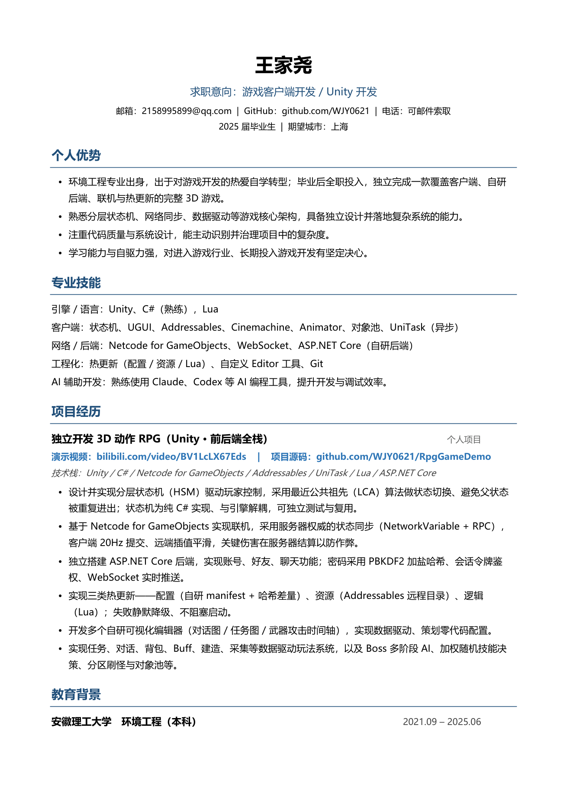

# RpgGameDemo — Unity 3D 动作 RPG（个人全栈项目）

> 一个人独立开发的 Unity 3D 动作 RPG / 生存建造游戏 —— 从**客户端**、**自研后端**、**联机同步**到**热更新**全栈实现。
> 涵盖角色控制、战斗、任务、对话、背包装备、建造、采集、Boss、联机、热更等完整系统。

**🎬 演示视频：** [Bilibili](https://www.bilibili.com/video/BV1LcLX67Eds)　|　**📄 个人简历：** 见 [文末预览](#-个人简历)　·　[PDF 下载](https://github.com/WJY0621/RpgGameDemo/raw/main/WangJiayao_Resume.pdf)

**🛠 技术栈：** Unity · C# · Netcode for GameObjects · Addressables · UniTask · Lua · ASP.NET Core

---

## ✨ 核心亮点

- **自研分层状态机（HSM）** 驱动玩家控制：采用最近公共祖先（LCA）算法做状态切换，避免父状态被重复进出；状态机为纯 C# 实现、与引擎解耦，可独立测试与复用。
- **服务器权威的联机同步**（Netcode for GameObjects）：连续状态用 `NetworkVariable` 同步、瞬时事件用 `ServerRpc`/`ClientRpc`；客户端 20Hz 提交、远端插值平滑，关键伤害在服务器结算以防作弊；支持本地直连与 Unity Relay 公网联机。
- **独立搭建 ASP.NET Core 后端**（`WorkDemoServer/`）：账号 / 好友 / 聊天系统，PBKDF2 加盐哈希存密码、会话令牌鉴权、WebSocket 实时推送，并兼做 Addressables 资源热更 CDN。
- **三类热更新**：配置（自研 manifest + 哈希差量）、资源（Addressables 远程目录）、逻辑（Lua）；失败静默降级、不阻塞启动。
- **多个自研可视化编辑器**：对话图编辑器、任务图编辑器、武器攻击 / Boss 技能时间轴编辑器，实现数据驱动、策划零代码配置。
- **数据驱动玩法系统**：任务、对话、背包、Buff、建造、采集、商店等均由 ScriptableObject / JSON 配置驱动。
- **三套分层 AI**：玩家 HSM、小怪简单 FSM、Boss 多阶段 FSM（加权随机技能决策）；怪物对象池 + 分区刷怪 + NavMesh 校验落点。

---

## 🏗 技术架构

| 层 | 模块 | 说明 |
|---|---|---|
| **底层框架** | 单例 / 事件系统 / 对象池 / 资源加载 / 场景管理 | 统一服务入口 `GameMgr`，服务定位器模式 |
| **角色与战斗** | HSM 状态机 / 伤害（`IDamageable`）/ Buff / 怪物 & Boss FSM | 统一伤害抽象，砍树挖矿与打怪复用同一套判定 |
| **核心玩法** | 任务 / 对话 / 背包装备 / 建造 / 采集 / 商店 | 数据驱动 + 可视化编辑器 |
| **存档** | 聚合根 `GameFile` + 各子系统自带序列化 | JSON 持久化，多账号隔离、分场景位置记忆 |
| **联机** | Netcode for GameObjects + Relay / Lobby | 服务器权威状态同步 + RPC |
| **后端** | ASP.NET Core（账号 / 社交 / 聊天 / 热更 CDN） | 分层 + DI + JSON 存储 + WebSocket |
| **工程化** | 热更新（配置 / 资源 / Lua）/ 自定义 Editor 工具 | — |

---

## 🛠 技术栈与环境

- **引擎**：Unity `2022.3.53f1c1`，渲染管线 URP `14.0.11`
- **客户端**：Addressables、Input System、Cinemachine、UniTask、AI Navigation、Netcode for GameObjects、TextMeshPro、Timeline
- **后端**：ASP.NET Core（.NET）、WebSocket、JSON 文件存储
- **脚本语言**：C#、Lua（逻辑热更）
- **解决方案**：`WorkDemo.sln`

---

## 📂 目录结构

```
Assets/Scripts/
├─ Manager/            全局管理器与服务入口（GameMgr / SceneMgr / UIMgr / FileMgr / PackageMgr …）
└─ GameCore/           各 gameplay 模块
   ├─ HSM/             玩家分层状态机
   ├─ GameCharacter/   玩家 / 怪物 / Boss / 角色 / 战斗
   ├─ GameTask /GameDialogue/   任务、对话（含图编辑器）
   ├─ GameItem/GamePackage/     物品、背包
   ├─ GameBuild/GameHarvest/    建造、采集
   ├─ GameBuff/GameCombat/      Buff、武器攻击时间轴
   ├─ GameNetwork/GameSocial/GameChat/   联机、社交、聊天
   └─ GameHotUpdate/            热更新（配置 / 资源 / Lua）
WorkDemoServer/        自研 ASP.NET Core 后端（账号 / 社交 / 聊天 / 热更 CDN）
Docs/                  项目设计与开发文档
```

> 说明：仓库通过 `.gitignore` 白名单**只提交源码**，不含 Unity 完整资源、`Library/` 及服务端运行数据。

---

## ▶ 运行方式

**客户端**
1. 用 Unity Hub 以 `2022.3.53f1c1` 打开项目根目录，等待导入与编译；
2. 从 `Assets/Scenes/GameInitializeScene.unity` 启动。

**服务端（可选，用于账号/好友/聊天/热更）**
```bash
cd WorkDemoServer
dotnet run        # 默认监听 http://127.0.0.1:5188
```
> 服务端不可用时，客户端会静默降级使用包内基线数据，不影响进入游戏。

---

## 📄 个人简历



> [📥 下载 PDF 版简历](https://github.com/WJY0621/RpgGameDemo/raw/main/WangJiayao_Resume.pdf)

---

## 👤 关于

个人独立开发项目，作为游戏客户端开发求职作品集。欢迎通过演示视频了解各系统的实现与设计思路。
